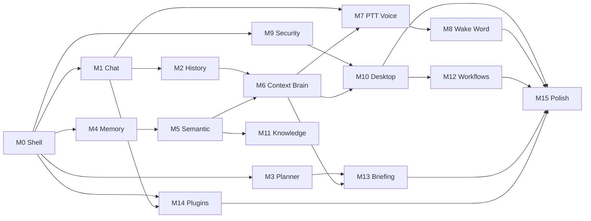

# Maira — Development Roadmap

This roadmap turns the scaffolded architecture into a **Version 1 product** aligned with [VISION.md](./VISION.md).

## How to Read This Document

| Principle | Meaning |
|---|---|
| **Independently usable** | After each milestone, Maira does something real. You can stop and use it daily without waiting for later work. |
| **1–3 days each** | One focused milestone per sprint. Scope is fixed; if it grows, split — do not slip. |
| **Dependency order** | Milestones build on prior ones, but each delivers standalone value. |
| **No code here** | This document defines *what* to build and *where*; implementation follows in separate tasks. |

## Current State

The repository contains a **production-grade folder structure** with placeholder modules only. No business logic, adapters, or UI widgets are implemented yet. Milestone 0 is the starting line.

## Architecture Layers (reference)

```
UI  →  App (bootstrap/DI)  →  Modules  →  Core (interfaces)
                                    ↓
                            Infrastructure (adapters)
```

---

## Phase 1 — Runnable Foundation

### Milestone 0: App Shell & Runtime Bootstrap

**Estimated effort:** 1–2 days

#### Goal

Launch a stable PySide6 desktop application with logging, configuration, path resolution, and an empty navigable shell. Maira opens reliably on every run.

#### Files

| Area | Paths |
|---|---|
| Entry | `maira/__main__.py` |
| Bootstrap | `maira/app/bootstrap.py`, `maira/app/lifecycle.py`, `maira/app/container.py`, `maira/app/settings.py` |
| Config | `config/default.yaml`, `config/logging.yaml`, `maira/infrastructure/config/yaml_loader.py` |
| Logging | `maira/infrastructure/logging/loguru_setup.py` |
| Paths | `maira/shared/utils/paths.py` |
| UI shell | `maira/ui/application.py`, `maira/ui/main_window/window.py`, `maira/ui/themes/dark.py` |
| Packaging | `pyproject.toml` (add runtime dependencies) |
| Tests | `tests/unit/test_paths.py`, `tests/unit/test_settings.py` |

#### Features

- `python -m maira` and `maira` console script launch the app
- YAML config loaded and merged into user data directory on first launch
- Loguru logging to console and rotating log file under `data/`
- `QApplication` with dark theme applied
- Main window with sidebar navigation placeholders (Chat, Planner, Memory, Voice, Settings)
- Graceful shutdown hook (lifecycle skeleton)
- Minimal DI container registering settings and event bus

#### Exit Criteria

- [ ] App launches on Windows without errors in under 5 seconds
- [ ] `data/` directory is created automatically on first run
- [ ] Logs appear in console and `data/logs/`
- [ ] Window shows navigation shell; closing the app exits cleanly
- [ ] Unit tests pass for config loading and path resolution

**Usable as:** A branded desktop shell you can open daily while features are added behind each nav item.

---

### Milestone 1: Offline Chat with Streaming

**Estimated effort:** 2–3 days

#### Goal

Hold a real-time conversation with a local Ollama model. Streaming tokens appear in the UI as they are generated.

#### Files

| Area | Paths |
|---|---|
| LLM port | `maira/core/interfaces/llm.py` |
| Brain port | `maira/core/interfaces/brain.py` |
| Domain | `maira/core/domain/entities/__init__.py`, `maira/core/domain/value_objects/__init__.py` |
| Ollama adapter | `maira/infrastructure/llm/ollama/client.py` |
| Brain module | `maira/modules/brain/service.py`, `maira/modules/brain/conversation/__init__.py`, `maira/modules/brain/streaming/__init__.py` |
| Event bus | `maira/core/bus/event_bus.py` |
| Async bridge | `maira/shared/utils/async_bridge.py` |
| UI | `maira/ui/views/chat/__init__.py`, `maira/ui/widgets/streaming_label.py`, `maira/ui/controllers/chat_controller.py` |
| Config | `config/default.yaml` (add `ollama` section: host, model) |
| Scripts | `scripts/setup_models.py` (verify Ollama is running) |
| Tests | `tests/unit/test_ollama_client.py`, `tests/integration/test_brain_streaming.py` |

#### Features

- Ollama HTTP client: list models, chat completion, token streaming
- `BrainService.send_message()` returns a stream of tokens via event bus or callback
- In-memory conversation session (single session; no DB yet)
- Chat view: message history, input box, send on Enter
- `StreamingLabel` widget renders tokens incrementally
- Error state when Ollama is unreachable (clear UI message, no crash)
- Chat controller runs LLM calls off the UI thread

#### Exit Criteria

- [ ] User can type a message and receive a streamed response from a local model
- [ ] UI remains responsive during generation
- [ ] Ollama offline shows a friendly error, not a stack trace
- [ ] Integration test passes against a running Ollama instance (skippable in CI)

**Usable as:** A private, offline ChatGPT-style client — no memory, no voice, but genuinely useful today.

---

### Milestone 2: Conversation Persistence

**Estimated effort:** 1–2 days

#### Goal

Conversations survive app restarts. User can resume the last session or start a new one.

#### Files

| Area | Paths |
|---|---|
| Storage port | `maira/core/interfaces/storage.py` |
| Domain | `maira/core/domain/entities/__init__.py` (Conversation, Message) |
| SQLite | `maira/infrastructure/persistence/sqlite/connection.py`, `maira/infrastructure/persistence/sqlite/repositories/__init__.py` |
| Migrations | `maira/infrastructure/persistence/sqlite/migrations/__init__.py`, `maira/infrastructure/persistence/sqlite/migrations/001_conversations.sql` |
| Brain | `maira/modules/brain/conversation/__init__.py` |
| UI | `maira/ui/views/chat/__init__.py` (session list or "New chat" button) |
| Scripts | `scripts/migrate_db.py` |
| Tests | `tests/unit/test_conversation_repository.py`, `tests/integration/test_conversation_persistence.py` |

#### Features

- SQLite schema: `conversations`, `messages` tables
- Migration runner applies schema on bootstrap
- Brain loads last conversation on startup
- "New conversation" clears in-memory session and creates a new DB record
- Messages saved after each turn (user + assistant)
- Chat view shows conversation title or timestamp

#### Exit Criteria

- [ ] Close and reopen app — previous messages are visible
- [ ] "New chat" starts a fresh conversation; old ones remain in DB
- [ ] `scripts/migrate_db.py` applies migrations idempotently
- [ ] Repository unit tests pass with in-memory SQLite

**Usable as:** Persistent offline chat with history — a daily driver for LLM conversations.

---

## Phase 2 — Productivity & Structured Memory

### Milestone 3: Todos & Notes

**Estimated effort:** 2 days

#### Goal

Manage todos and free-form notes without involving the AI. Maira becomes a lightweight daily productivity surface.

#### Files

| Area | Paths |
|---|---|
| Planner port | `maira/core/interfaces/planner.py` |
| Domain | `maira/core/domain/entities/__init__.py` (Task, Note), `maira/core/domain/value_objects/__init__.py` (TaskStatus, Priority) |
| SQLite | `maira/infrastructure/persistence/sqlite/migrations/002_planner.sql`, repositories for tasks and notes |
| Planner module | `maira/modules/planner/service.py`, `maira/modules/planner/todos/__init__.py`, `maira/modules/planner/notes/__init__.py` |
| UI | `maira/ui/views/planner/__init__.py`, `maira/ui/controllers/planner_controller.py` |
| Tests | `tests/unit/test_planner_service.py` |

#### Features

- CRUD for todos: title, done/undone, optional due date, priority
- CRUD for notes: title, body, created/updated timestamps
- Planner view: tabbed or split todos + notes list
- Add, complete, delete, and edit inline
- Data stored in SQLite (planner tables)

#### Exit Criteria

- [ ] Create 5 todos, mark 2 complete, delete 1 — state persists across restart
- [ ] Create and edit a note — body saves on blur or explicit save
- [ ] Planner view accessible from sidebar without opening Chat
- [ ] Planner service unit tests cover CRUD operations

**Usable as:** A minimal offline todo + notes app inside Maira, even when Ollama is off.

---

### Milestone 4: Structured Memory Store

**Estimated effort:** 2 days

#### Goal

Manually capture and browse long-term memories (preferences, ideas, project info) as structured records.

#### Files

| Area | Paths |
|---|---|
| Memory port | `maira/core/interfaces/memory.py` |
| Domain | `maira/core/domain/entities/__init__.py` (MemoryEntry), `maira/core/domain/value_objects/__init__.py` (MemoryCategory) |
| SQLite | `maira/infrastructure/persistence/sqlite/migrations/003_memory.sql`, memory repository |
| Memory module | `maira/modules/memory/service.py`, `maira/modules/memory/store/__init__.py` |
| UI | `maira/ui/views/memory/__init__.py` |
| Tests | `tests/unit/test_memory_store.py` |

#### Features

- Memory categories: preference, conversation, task, note, idea, project
- Store, list, filter by category, edit, and delete memory entries
- Memory browse UI: searchable list (keyword filter on title/body for now)
- Optional link from planner notes → "Save to memory"

#### Exit Criteria

- [ ] User can add a preference ("I prefer dark mode") and find it in Memory view
- [ ] Filter by category works
- [ ] Memories persist in SQLite across restarts
- [ ] Memory store unit tests pass

**Usable as:** A personal knowledge journal with categorized entries.

---

### Milestone 5: Semantic Memory Retrieval

**Estimated effort:** 2–3 days

#### Goal

Search memories by meaning, not just keywords. ChromaDB and local embeddings power semantic recall.

#### Files

| Area | Paths |
|---|---|
| Ports | `maira/core/interfaces/vector_store.py`, `maira/core/interfaces/embeddings.py` |
| ChromaDB | `maira/infrastructure/vector/chromadb/client.py`, `maira/infrastructure/vector/chromadb/collections.py` |
| Embeddings | `maira/infrastructure/embeddings/sentence_transformers/encoder.py` |
| Memory | `maira/modules/memory/retrieval/__init__.py`, `maira/modules/memory/service.py` (upsert on store, query on search) |
| Config | `config/default.yaml` (embedding model name, chroma path) |
| UI | `maira/ui/views/memory/__init__.py` (semantic search box) |
| Scripts | `scripts/setup_models.py` (download embedding model) |
| Tests | `tests/integration/test_semantic_retrieval.py` |

#### Features

- On memory create/update: embed text and upsert into ChromaDB collection
- On memory delete: remove from ChromaDB
- Semantic search: query string → top-k similar memories
- Memory UI search box uses semantic retrieval (fallback to keyword if embedder unavailable)
- ChromaDB persisted under `data/chroma/`

#### Exit Criteria

- [ ] Searching "coding editor" returns a memory about "I use VS Code" even without exact words
- [ ] New memories are indexed within 2 seconds of save
- [ ] Deleting a memory removes it from both SQLite and ChromaDB
- [ ] Integration test validates embed → store → retrieve round trip

**Usable as:** A semantic second-brain search tool independent of the chat feature.

---

### Milestone 6: Context-Aware Brain

**Estimated effort:** 1–2 days

#### Goal

The Brain automatically injects relevant memories into the LLM prompt so chat responses reflect what Maira already knows.

#### Files

| Area | Paths |
|---|---|
| Brain | `maira/modules/brain/context/__init__.py`, `maira/modules/brain/service.py` |
| Memory | `maira/modules/memory/service.py` (expose `recall(query, k)` ) |
| Domain events | `maira/core/domain/events/__init__.py` (ContextAssembled) |
| Config | `config/default.yaml` (context: max_memories, max_tokens) |
| Tests | `tests/unit/test_context_assembly.py` |

#### Features

- Before each LLM call: embed user message, retrieve top-k memories
- System prompt includes retrieved memories with clear delimiters
- Context window budget: truncate oldest memories if over token limit
- Optional debug panel in chat showing which memories were injected (dev toggle)

#### Exit Criteria

- [ ] After saving "My name is Alex" to memory, asking "What's my name?" returns correct answer
- [ ] Irrelevant memories are not injected (manual spot-check with 10+ entries)
- [ ] Context assembly unit test mocks memory retrieval and validates prompt shape
- [ ] No regression in streaming chat from Milestone 1–2

**Usable as:** An AI assistant that remembers you — the core "second brain" promise begins here.

---

## Phase 3 — Voice Interface

### Milestone 7: Push-to-Talk Voice

**Estimated effort:** 2–3 days

#### Goal

Speak to Maira and hear responses offline. Push-to-talk mode works end-to-end without wake word.

#### Files

| Area | Paths |
|---|---|
| Voice port | `maira/core/interfaces/voice.py` |
| Whisper | `maira/infrastructure/speech/whisper/engine.py` |
| Kokoro | `maira/infrastructure/speech/kokoro/engine.py` |
| Audio | `maira/infrastructure/speech/audio/stream.py` |
| Voice module | `maira/modules/voice/service.py`, `maira/modules/voice/stt/__init__.py`, `maira/modules/voice/tts/__init__.py` |
| UI | `maira/ui/views/voice/__init__.py`, `maira/ui/controllers/voice_controller.py` |
| Config | `config/default.yaml` (whisper model path, kokoro voice, audio device) |
| Scripts | `scripts/setup_models.py` (whisper + kokoro assets) |
| Tests | `tests/integration/test_voice_pipeline.py` |

#### Features

- Push-to-talk button: hold to record, release to transcribe
- Whisper.cpp offline transcription
- Transcribed text sent to Brain (same path as typed chat)
- Kokoro TTS speaks the assistant response
- Voice view: mic button, status indicator (idle / listening / speaking)
- Voice mode toggle in chat view (optional shortcut)

#### Exit Criteria

- [ ] Hold mic → speak → release → text appears in chat and AI responds
- [ ] Response is spoken aloud via Kokoro
- [ ] Entire flow works with network disabled (after models are local)
- [ ] Audio errors show UI feedback without crashing

**Usable as:** An offline voice assistant for hands-busy moments (push-to-talk).

---

### Milestone 8: Wake Word & Interruptible Speech

**Estimated effort:** 2 days

#### Goal

Activate Maira hands-free with a wake word. User can interrupt TTS mid-sentence.

#### Files

| Area | Paths |
|---|---|
| Voice | `maira/modules/voice/wake_word/__init__.py`, `maira/modules/voice/service.py`, `maira/modules/voice/tts/__init__.py` |
| Audio | `maira/infrastructure/speech/audio/stream.py` (continuous listen mode) |
| UI | `maira/ui/views/voice/__init__.py` (wake indicator, mode toggles) |
| Config | `config/default.yaml` (wake_word, sensitivity) |
| Tests | `tests/unit/test_wake_word_state_machine.py` |

#### Features

- Wake word listener runs in background thread (configurable phrase, e.g. "Hey Maira")
- On wake: enter listening mode automatically (no button hold)
- Push-to-talk remains available as alternative mode
- Interruptible TTS: speaking stops immediately on wake word or mic press
- Voice view shows current mode: push-to-talk / wake word / off

#### Exit Criteria

- [ ] Saying wake word activates listening without mouse/keyboard
- [ ] Pressing mic or saying wake word during TTS stops playback within 500 ms
- [ ] CPU usage acceptable during idle wake-word listen (document baseline in README)
- [ ] Mode preference persists in config

**Usable as:** A hands-free offline voice companion matching VISION.md voice requirements.

---

## Phase 4 — Security & Desktop Control

### Milestone 9: Security Gate

**Estimated effort:** 1–2 days

#### Goal

All sensitive operations pass through a permission check and user confirmation before execution.

#### Files

| Area | Paths |
|---|---|
| Security port | `maira/core/interfaces/security.py` |
| Domain | `maira/core/domain/value_objects/__init__.py` (PermissionLevel, ActionRisk) |
| Security module | `maira/modules/security/service.py`, `maira/modules/security/permissions/__init__.py`, `maira/modules/security/confirmation/__init__.py` |
| UI | `maira/ui/widgets/confirm_dialog.py` |
| Events | `maira/core/domain/events/__init__.py` (DangerousActionRequested, ActionConfirmed) |
| SQLite | `maira/infrastructure/persistence/sqlite/migrations/004_audit_log.sql` |
| Tests | `tests/unit/test_security_service.py` |

#### Features

- Risk tiers: safe (auto-allow), sensitive (confirm), dangerous (confirm + audit log)
- `SecurityService.authorize(action)` returns allow / deny / needs_confirmation
- Qt confirmation dialog shows action description and consequences
- Audit log records confirmed dangerous actions with timestamp
- Default policy: read-only safe; shell commands and app launches require confirmation

#### Exit Criteria

- [ ] A "dangerous" action blocks until user clicks Confirm
- [ ] Cancelled actions do not execute and are logged
- [ ] Confirmed actions appear in audit log table
- [ ] Security unit tests cover all three risk tiers

**Usable as:** A safety layer ready for desktop automation — required before Milestone 10.

---

### Milestone 10: Desktop Controller

**Estimated effort:** 2–3 days

#### Goal

Control the computer through natural language: open apps, open URLs, search local files, and read document contents.

#### Files

| Area | Paths |
|---|---|
| Desktop port | `maira/core/interfaces/desktop.py` |
| OS adapter | `maira/infrastructure/os/platform.py` |
| Filesystem | `maira/infrastructure/filesystem/local.py` |
| Desktop module | `maira/modules/desktop_controller/service.py`, `maira/modules/desktop_controller/actions/__init__.py` |
| Brain | `maira/modules/brain/service.py` (tool/command parsing or function-calling) |
| Security | Integration with `maira/modules/security/service.py` |
| Config | `config/default.yaml` (allowed apps, search roots) |
| Tests | `tests/unit/test_desktop_actions.py`, `tests/integration/test_desktop_controller.py` |

#### Features

- Actions: `open_app`, `open_url`, `search_files`, `read_document`
- Windows OS integration via subprocess / `os.startfile` / shell APIs
- File search within configured roots (Downloads, Documents, projects)
- Read plain text, markdown, and PDF (basic text extraction)
- Brain interprets user intent and dispatches to desktop controller
- All non-read actions routed through security gate

#### Exit Criteria

- [ ] "Open Notepad" launches Notepad after confirmation
- [ ] "Open https://github.com" opens default browser after confirmation
- [ ] "Find files named README" returns a list in chat
- [ ] "Read [file path]" returns file contents in chat
- [ ] Denied/cancelled actions never execute

**Usable as:** A voice or text command to control your desktop safely — core "Maira executes" behavior.

---

### Milestone 11: Knowledge Base & Document Indexing

**Estimated effort:** 2–3 days

#### Goal

Index local documents for semantic search. Ask questions about files on disk.

#### Files

| Area | Paths |
|---|---|
| Knowledge port | `maira/core/interfaces/knowledge.py` |
| Knowledge module | `maira/modules/knowledge_base/service.py`, `maira/modules/knowledge_base/indexing/__init__.py` |
| Vector | Reuse ChromaDB collections (separate `documents` collection) |
| Embeddings | Reuse sentence-transformers encoder |
| Filesystem | `maira/infrastructure/filesystem/local.py` |
| UI | `maira/ui/views/memory/__init__.py` or new knowledge panel in settings |
| Config | `config/default.yaml` (index paths, chunk size) |
| Tests | `tests/integration/test_knowledge_indexing.py` |

#### Features

- Index folder: walk directory, chunk text files / markdown / PDF
- Embed chunks and store in ChromaDB `documents` collection
- `KnowledgeBaseService.search(query)` returns relevant passages with source path
- Brain can call knowledge search when user asks about local docs
- Manual "Re-index folder" action in UI
- Index status: file count, last indexed timestamp

#### Exit Criteria

- [ ] Index a folder of 10+ markdown files in under 60 seconds
- [ ] Ask "What does [doc] say about X?" — answer cites correct file
- [ ] Re-index is idempotent (no duplicate chunks)
- [ ] Works fully offline

**Usable as:** Local RAG over your project docs and notes.

---

## Phase 5 — Automation & Daily Workflow

### Milestone 12: Workflow Automation

**Estimated effort:** 2 days

#### Goal

Execute predefined multi-step workflows from a single natural-language command.

#### Files

| Area | Paths |
|---|---|
| Automation port | `maira/core/interfaces/automation.py` |
| Automation module | `maira/modules/automation/service.py`, `maira/modules/automation/workflows/__init__.py` |
| Desktop | Reuse `maira/modules/desktop_controller/actions/` |
| Security | Confirm before workflow with any sensitive step |
| Config | `config/workflows/` (YAML workflow definitions), `config/default.yaml` |
| Assets | `assets/workflows/` (bundled example: "start work") |
| Tests | `tests/unit/test_workflow_parser.py`, `tests/integration/test_workflow_execution.py` |

#### Features

- Workflow YAML schema: name, description, steps (open_app, open_url, open_folder, delay)
- Register workflows at bootstrap from `config/workflows/` and `assets/workflows/`
- Brain matches user intent to workflow by name or description
- Execute steps sequentially with error handling (stop on failure, report in chat)
- Example workflow: "Start work" → open IDE + project folder + browser tab

#### Exit Criteria

- [ ] Saying "Start my work environment" runs a 3-step workflow after confirmation
- [ ] Invalid workflow YAML is rejected at load with clear log error
- [ ] Failed step aborts remaining steps and reports which step failed
- [ ] At least one bundled workflow ships in `assets/workflows/`

**Usable as:** One-command environment launcher — direct VISION.md success metric.

---

### Milestone 13: Reminders & Daily Briefing

**Estimated effort:** 2 days

#### Goal

Schedule reminders and receive a daily briefing that summarizes todos, reminders, and recent memories.

#### Files

| Area | Paths |
|---|---|
| Planner | `maira/modules/planner/reminders/__init__.py`, `maira/modules/planner/briefing/__init__.py`, `maira/modules/planner/service.py` |
| SQLite | `maira/infrastructure/persistence/sqlite/migrations/005_reminders.sql` |
| Brain | `maira/modules/brain/service.py` (briefing generation prompt) |
| UI | `maira/ui/views/planner/__init__.py` (reminders list, briefing panel) |
| Events | `maira/core/domain/events/__init__.py` (ReminderDue) |
| Tests | `tests/unit/test_reminders.py`, `tests/unit/test_briefing.py` |

#### Features

- Create reminders with datetime; one-shot and daily repeat
- Background timer checks due reminders every minute; emits `ReminderDue` event
- Desktop notification on due reminder (Qt system tray or native notification)
- Daily briefing on app launch (or on demand): overdue todos, today's reminders, top memories
- Brain generates natural-language briefing from structured data

#### Exit Criteria

- [ ] Reminder fires a notification at the scheduled time
- [ ] Daily briefing appears on first launch of the day
- [ ] Briefing includes todos, reminders, and at least one memory snippet
- [ ] Reminder CRUD persists across restart

**Usable as:** A morning command center — planner + AI briefing in one place.

---

## Phase 6 — Extensibility & V1 Completion

### Milestone 14: Plugin System MVP

**Estimated effort:** 2–3 days

#### Goal

Load external plugins from `plugins_external/` that hook into Brain and Planner without modifying core code.

#### Files

| Area | Paths |
|---|---|
| Plugin port | `maira/core/interfaces/plugin.py` |
| API | `maira/plugins/api/hooks.py`, `maira/plugins/api/manifest.py` |
| Manager | `maira/plugins/manager/loader.py`, `maira/plugins/manager/registry.py`, `maira/plugins/manager/lifecycle.py` |
| Bootstrap | `maira/app/bootstrap.py`, `maira/app/container.py` (register plugins) |
| Template | `plugins_external/_template/` |
| Scripts | `scripts/create_plugin.py` |
| Builtin example | `maira/plugins/builtin/example_greeting/` (new) |
| Tests | `tests/integration/test_plugin_loading.py` |

#### Features

- Discover plugins via `plugin.yaml` manifest in `plugins_external/`
- Load entry point; validate `maira_api` version compatibility
- Hook: `on_message_received`, `on_message_completed` (Brain pipeline)
- Hook: `on_todo_created` (Planner pipeline)
- Registry lists loaded plugins in Settings view
- `scripts/create_plugin.py` scaffolds a new plugin from `_template`
- Builtin example plugin demonstrates one hook

#### Exit Criteria

- [ ] Drop a plugin folder in `plugins_external/` → it loads on next launch
- [ ] Example plugin modifies or logs a message without crashing
- [ ] Invalid manifest is skipped with error log, app still starts
- [ ] `create_plugin.py` generates a working skeleton

**Usable as:** An extensible platform — third-party features without forking Maira.

---

### Milestone 15: Settings, Integration & V1 Polish

**Estimated effort:** 2–3 days

#### Goal

Wire all subsystems into a cohesive V1 product. Settings UI exposes every configurable subsystem. App is stable enough for daily use.

#### Files

| Area | Paths |
|---|---|
| Settings UI | `maira/ui/views/settings/__init__.py`, `maira/ui/controllers/settings_controller.py` |
| Bootstrap | `maira/app/bootstrap.py`, `maira/app/lifecycle.py`, `maira/app/container.py` (final wiring) |
| Config | `config/default.yaml` (complete schema for all subsystems) |
| Themes | `maira/ui/themes/dark.py` (+ light theme if time permits) |
| Main window | `maira/ui/main_window/window.py` (status bar: Ollama, voice, plugin count) |
| Tests | `tests/ui/test_main_window.py`, `tests/integration/test_full_startup.py` |
| Docs | `README.md` (install, prerequisites, milestone feature list) |

#### Features

- Settings panels: Ollama (host, model), Voice (mode, wake word), Memory (index paths), Security (confirm toggles), Plugins (list, enable/disable)
- Status bar indicators: Ollama connected, voice mode, offline badge
- Full bootstrap registers all module services in DI container
- End-to-end smoke test: launch → chat → save memory → voice query → run workflow
- Error boundaries: subsystem failure degrades gracefully (e.g. voice off if no mic)
- README with setup steps for Ollama, Whisper, Kokoro, and embedding model

#### Exit Criteria

- [ ] All settings persist across restart
- [ ] Status bar accurately reflects subsystem health
- [ ] Full startup integration test passes locally
- [ ] Developer can use Maira daily for chat, todos, voice, and one workflow without workarounds
- [ ] VISION.md MVP features are all represented (checklist below)

**Usable as:** Maira V1 — the complete offline-first Personal AI Operating System.

---

## V1 Completion Checklist

Cross-reference against [VISION.md](./VISION.md) MVP:

| VISION Feature | Milestone |
|---|---|
| Local LLM + conversational interface | M1 |
| Context management | M6 |
| Streaming responses | M1 |
| Persistent memory (all categories) | M4 |
| Semantic retrieval | M5 |
| Wake word | M8 |
| Offline STT (Whisper) | M7 |
| Kokoro TTS + interruptible speech | M7, M8 |
| Push-to-talk | M7 |
| Open apps / URLs / files / read docs | M10 |
| Predefined workflows | M12 |
| Security confirmation | M9 |
| Todos, notes, planner, reminders, briefing | M3, M13 |
| Plugin system | M14 |

---

## Milestone Summary

| # | Milestone | Days | Standalone Value |
|---|---|---|---|
| 0 | App Shell & Runtime Bootstrap | 1–2 | Opens reliably |
| 1 | Offline Chat with Streaming | 2–3 | Local ChatGPT |
| 2 | Conversation Persistence | 1–2 | Chat with history |
| 3 | Todos & Notes | 2 | Daily productivity |
| 4 | Structured Memory Store | 2 | Knowledge journal |
| 5 | Semantic Memory Retrieval | 2–3 | Meaning-based search |
| 6 | Context-Aware Brain | 1–2 | AI that remembers you |
| 7 | Push-to-Talk Voice | 2–3 | Voice assistant |
| 8 | Wake Word & Interruptible Speech | 2 | Hands-free companion |
| 9 | Security Gate | 1–2 | Safe execution layer |
| 10 | Desktop Controller | 2–3 | "Maira executes" |
| 11 | Knowledge Base | 2–3 | Local doc Q&A |
| 12 | Workflow Automation | 2 | One-command launcher |
| 13 | Reminders & Daily Briefing | 2 | Morning command center |
| 14 | Plugin System MVP | 2–3 | Extensible platform |
| 15 | Settings & V1 Polish | 2–3 | Complete V1 product |

**Total estimated effort:** 28–38 developer-days (~6–8 weeks at steady pace).

---

## What Comes After V1

Deferred to post-V1 per VISION.md long-term roadmap:

- Phase 2: Developer assistant, Git integration, coding workflows
- Phase 3: Vision, OCR, screenshot analysis
- Phase 4: Multi-agent architecture
- Phase 5: Android companion, shared memory, remote execution
- Phase 6: Plugin marketplace, smart home, wearables

Do not start these until V1 exit criteria in Milestone 15 are met and Maira is used daily.

---

## Dependency Graph



---

*Last updated: aligned with repository scaffold and VISION.md v0.1.*
